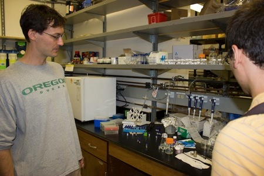
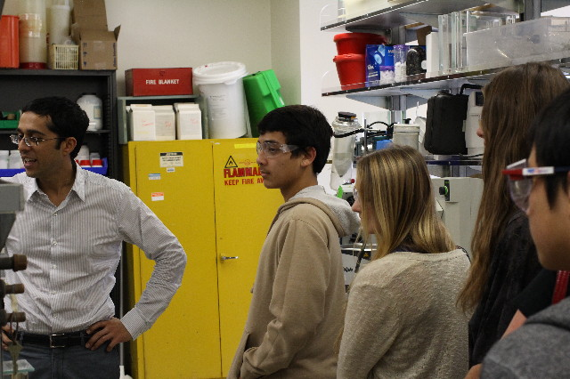
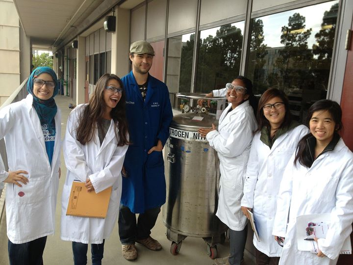

##Outreach
_______________

Our lab engages in outreach efforts with the Hands-On-Lab, part of the San Diego Science Project. These efforts are made possible through funding from the National Science Foundation.

Graduate student Michael Hardy describing his research on vesicle reproduction during a Lab tour with alumni members of the Hands-On-Lab, part of the San Diego Science Project.

Dr. Neal Devaraj is seen touring the lab with Hands-On-Lab members.

Graduate student Christian Cole posing with a group of Hands-On-Lab members after a long day at work.
